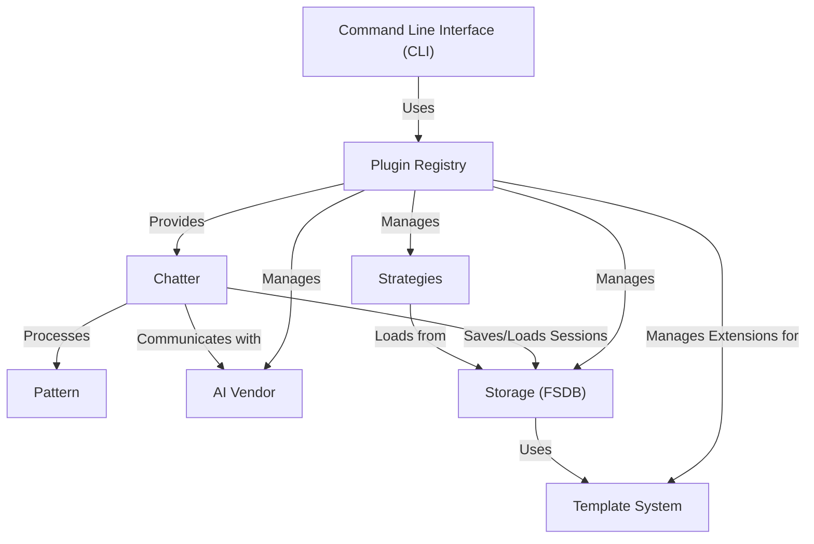
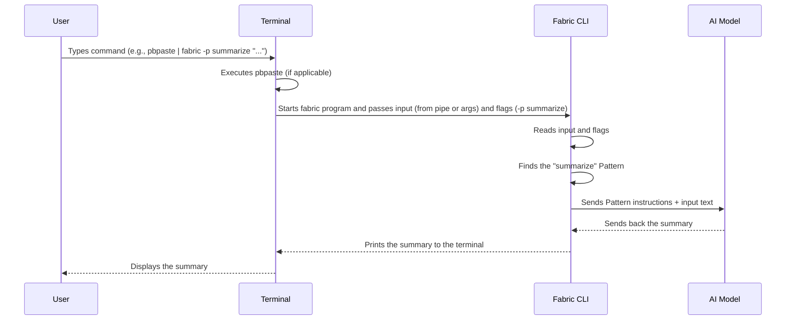
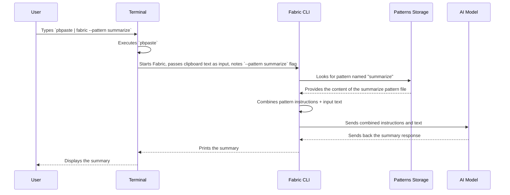
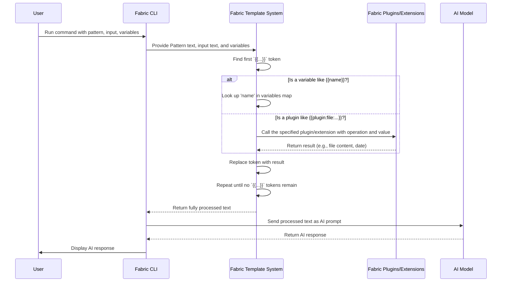
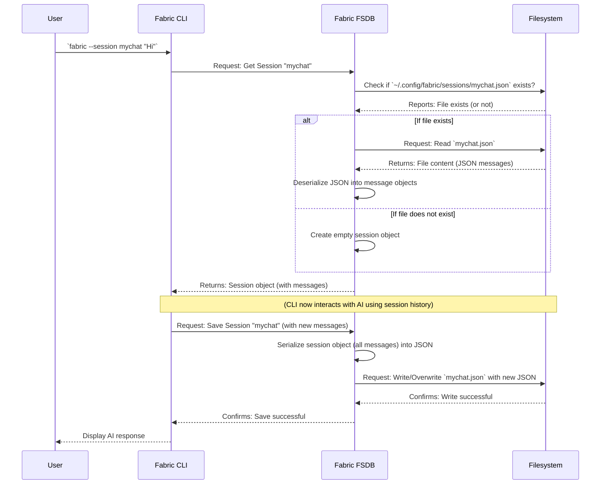
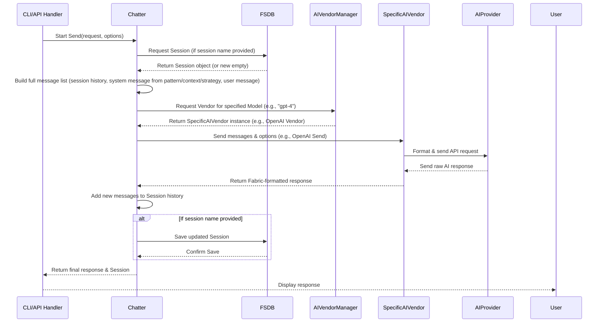
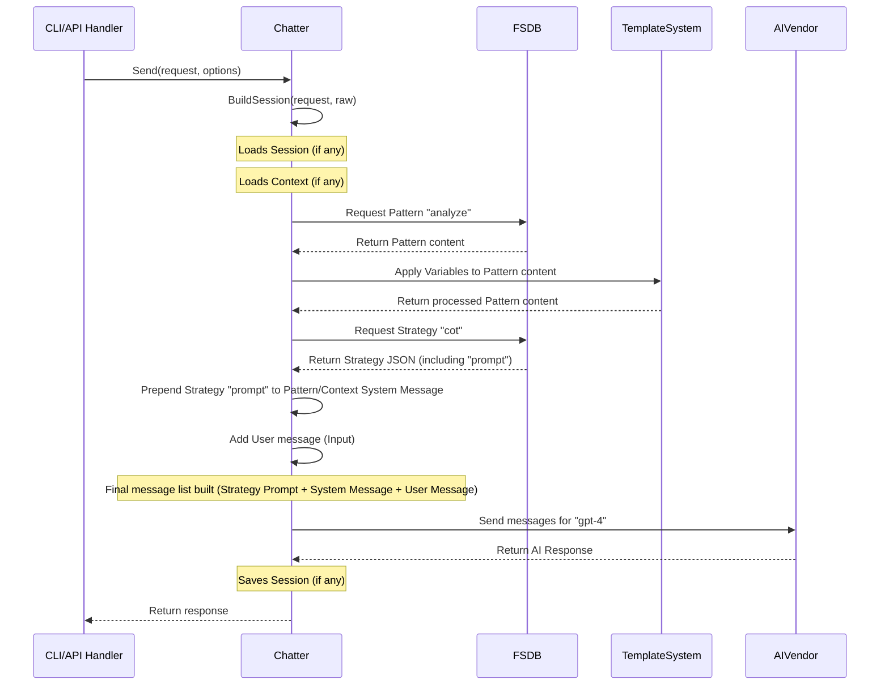

# Tutorial: fabric

Fabric is an **open-source framework** designed to augment humans using AI.
It provides a **Command Line Interface (CLI)** as the main interaction point to leverage various AI models from different **AI Vendors**.
Users define specific tasks and AI behaviors using **Patterns**, which are made dynamic by a **Template System**.
Fabric manages data like patterns, contexts, and sessions through its **Storage (FSDB)** system, applies different AI "thinking styles" using **Strategies**, and uses a **Chatter** component to handle communication with the AI.
All these components are managed and orchestrated by a central **Plugin Registry**.

## Visual Overview



## Chapters

1. [Command Line Interface (CLI)
](01_command_line_interface__cli__.md)
2. [Pattern
](02_pattern_.md)
3. [Template System
](03_template_system_.md)
4. [Storage (FSDB)
](04_storage__fsdb__.md)
5. [AI Vendor
](05_ai_vendor_.md)
6. [Chatter
](06_chatter_.md)
7. [Strategies
](07_strategies_.md)
8. [Plugin Registry
](08_plugin_registry_.md)

---

# Chapter 1: Command Line Interface (CLI)

Welcome to the first chapter of the Fabric tutorial! We're excited to guide you through using this powerful tool.

Fabric is designed to help you augment your creativity and productivity using AI. Think of it as a toolkit for applying AI to everyday tasks right from your computer.

The main way you'll interact with Fabric is through something called the **Command Line Interface**, or **CLI** for short. If you've ever typed commands into a terminal window (like Command Prompt on Windows, Terminal on macOS, or Bash on Linux), you've used a CLI.

Imagine the CLI is like the control panel for Fabric. You type commands to tell Fabric what task you want to perform with the help of AI, what information it should use, and how it should behave.

### Our First Task: Summarizing Text

Let's start with a common task: summarizing a piece of text. You might have an article, a document, or just some notes that you want a quick summary of. Fabric can help with this using its CLI.

How do we tell Fabric to summarize something using the CLI? It involves a few steps:

1. **Give Fabric the text:** Fabric needs the input text it should work on.
2. **Tell Fabric what to do:** We need to instruct Fabric to perform a *summarization* task.

Let's see how this looks using the Fabric CLI.

### Using the Fabric Command

When you installed Fabric, you got a command-line tool you can run. You can open your terminal and type `fabric`. If you just type `fabric` and press Enter, you'll see a help message listing all the things Fabric can do:

```bash
fabric -h
```

This shows you the basic way to use Fabric:

```plaintext
Usage:
  fabric [OPTIONS]
```

This means you type `fabric` followed by different `[OPTIONS]` that tell Fabric what you want it to do. These options are also called **flags**.

### Providing Input Text

How do you give Fabric the text you want to summarize? A common way in the command line is using a "pipe" (`|`). This takes the output of one command and sends it as the input to another command.

For example, on macOS, the command `pbpaste` copies the contents of your clipboard. You can pipe this directly into Fabric:

```bash
pbpaste | fabric
```

*(Note: If you're on Windows or Linux, the README file provides alternatives for `pbpaste`.)*

If you run `pbpaste | fabric` without telling Fabric what to do, Fabric won't know you want a summary. It might just pass the text through or do nothing specific. We need to tell it the *task*.

### Telling Fabric What to Do: Patterns

Fabric uses something called **Patterns** to define specific tasks for the AI. A Pattern is like a pre-written instruction set (or prompt) for the AI. Fabric comes with many built-in Patterns, including one for summarizing!

To tell Fabric to use the "summarize" pattern, you use the `-p` or `--pattern` flag followed by the pattern's name:

```bash
fabric --pattern summarize
```

Now, let's combine providing input and specifying the pattern:

```bash
pbpaste | fabric --pattern summarize
```

This command does the following:

1. `pbpaste`: Gets the text from your clipboard.
2. `|`: Sends that text as input to the next command (`fabric`).
3. `fabric`: Runs the Fabric program.
4. `--pattern summarize`: Tells Fabric to use the built-in "summarize" Pattern on the input text it received.

When you run this, Fabric will send the clipboard text and the instructions from the "summarize" pattern to an AI model, and then print the summary it gets back right there in your terminal!

### Common CLI Flags (Options)

Let's look at a few more useful flags you'll often use with the Fabric CLI:

* `-p <pattern_name>` or `--pattern <pattern_name>`: (As we saw) Specifies which **Pattern** to use (e.g., `summarize`, `analyze_claims`, etc.).
* `-s` or `--stream`: Tells Fabric to show you the AI's response as it's being generated, word by word, instead of waiting for the whole response.
* `-m <model_name>` or `--model <model_name>`: Allows you to choose a different AI model to use if you have multiple configured (e.g., `gpt-4`, `claude-3`, `llama3`).
* `-o <filename>` or `--output <filename>`: Saves the AI's response to a file instead of just printing it in the terminal.
* `-h` or `--help`: Shows the help message with all available options.

### More Examples

Let's try a few variations of our summarize task using these flags.

1. **List available patterns:**

    ```bash
    fabric --listpatterns
    ```

    This command doesn't process text; it simply asks Fabric to show you the names of all the Patterns it has installed. This is useful for discovering what tasks Fabric can do.

2. **Summarize text and stream the output:**

    ```bash
    pbpaste | fabric --pattern summarize --stream
    ```

    Same as before, but you'll see the summary appear live as the AI generates it.

3. **Summarize text using a different model (e.g., `gpt-4`):**

    ```bash
    pbpaste | fabric --pattern summarize --model gpt-4
    ```

    If you have `gpt-4` configured, Fabric will use that specific model for the summarization task.

4. **Summarize text and save the output to a file:**

    ```bash
    pbpaste | fabric --pattern summarize --output my_summary.md
    ```

    This will run the summarization and save the result into a file named `my_summary.md` in your current directory. The AI's response might still be printed to the terminal unless Fabric's output handling specifically suppresses it when `-o` is used, but the primary goal is the file saving.

### How the CLI Works (Under the Hood)

When you type a command like `pbpaste | fabric --pattern summarize "Some text"` into your terminal and press Enter, here's a simple look at what happens:



In slightly more detail:

1. Your **Terminal** program interprets what you typed.
2. It runs the first command (`pbpaste` in our example) and captures its output.
3. The pipe (`|`) directs that output to become the standard input for the `fabric` command.
4. The `fabric` program starts.
5. Inside the `fabric` program, the **Fabric CLI** component reads all the options (flags like `--pattern summarize`) and any input text (from the pipe or directly typed after the command).
6. The CLI then uses this information to figure out exactly what task you want to perform. It looks up the specified Pattern (like `summarize`).
7. It prepares the request to send to the AI model, combining the Pattern's instructions with your input text.
8. It sends this request to the configured **AI Model** (like GPT-4, Claude, Llama, etc.).
9. The AI Model processes the request and sends back a response (the summary).
10. The Fabric CLI receives the response and prints it out to your **Terminal**, or saves it to a file if you used the `-o` flag.

This flow shows that the CLI is the essential layer that translates your typed commands and options into actions that Fabric can perform with the help of AI.

Looking briefly at the code confirms this structure. The `cli` package contains the logic for handling command-line arguments.

The `cli/flags.go` file defines a `Flags` struct, which is a Go language way of structuring data. This struct holds all the possible options (flags) you can provide, like `Pattern`, `Stream`, `Model`, etc. The program parses the command you type and fills in these fields.

```go
// cli/flags.go
type Flags struct {
 Pattern string `short:"p" long:"pattern" yaml:"pattern" description:"Choose a pattern from the available patterns" default:""`
 // ... many other flags are defined here ...
 Stream bool `short:"s" long:"stream" yaml:"stream" description:"Stream"`
 // ... more flags ...
 Model string `short:"m" long:"model" yaml:"model" description:"Choose model"`
 // ... and so on ...
}
```

*(Note: The `short` and `long` tags tell the program how to recognize the flag on the command line, like `-p` or `--pattern`. The `yaml` tag is for configuration files, which we might touch on later.)*

The main logic for processing these flags is in the `cli/cli.go` file. The `Cli` function there is the entry point after the flags have been read. It checks which flags were set and calls the appropriate functions.

```go
// cli/cli.go (simplified)
func Cli(version string) (err error) {
 var currentFlags *Flags
 if currentFlags, err = Init(); err != nil { // Read the flags from the command line
  return
 }

 // Check if the user wants to list patterns
 if currentFlags.ListPatterns {
  err = fabricDb.Patterns.ListNames(currentFlags.ShellCompleteOutput)
  return // Done with this command
 }

 // ... many other checks for different flags ...

 // If none of the above, it's probably a chat request...
 // ... logic to prepare the chat request using the flags ...

 // ... logic to send the request to the AI and handle the response ...

 return
}
```

This gives you a peek at how the code reads your command-line input and uses it to decide what Fabric should do.

### Conclusion

The Command Line Interface is your primary tool for interacting with Fabric. By typing the `fabric` command followed by various flags like `--pattern`, `--stream`, and `--model`, you can direct Fabric to perform specific AI tasks on the input you provide.

You've learned how to use the CLI for a basic task like summarization and seen some of the key flags that control Fabric's behavior. You also have a high-level understanding of how the CLI processes your commands.

In the next chapter, we'll dive deeper into [Patterns](02_pattern_.md), the pre-defined instructions that tell Fabric *exactly* how to use the AI for different tasks.

[Next Chapter: Pattern](02_pattern_.md)

<sub><sup>Generated by [AI Codebase Knowledge Builder](https://github.com/The-Pocket/Tutorial-Codebase-Knowledge).</sup></sub> <sub><sup>**References**: [[1]](https://github.com/danielmiessler/fabric/blob/1e81da5f42c34710905214701f8df2af0f05924a/README.md), [[2]](https://github.com/danielmiessler/fabric/blob/1e81da5f42c34710905214701f8df2af0f05924a/cli/README.md), [[3]](https://github.com/danielmiessler/fabric/blob/1e81da5f42c34710905214701f8df2af0f05924a/cli/cli.go), [[4]](https://github.com/danielmiessler/fabric/blob/1e81da5f42c34710905214701f8df2af0f05924a/cli/flags.go), [[5]](https://github.com/danielmiessler/fabric/blob/1e81da5f42c34710905214701f8df2af0f05924a/completions/_fabric), [[6]](https://github.com/danielmiessler/fabric/blob/1e81da5f42c34710905214701f8df2af0f05924a/completions/fabric.bash), [[7]](https://github.com/danielmiessler/fabric/blob/1e81da5f42c34710905214701f8df2af0f05924a/completions/fabric.fish), [[8]](https://github.com/danielmiessler/fabric/blob/1e81da5f42c34710905214701f8df2af0f05924a/main.go)</sup></sub>

---

# Chapter 2: Pattern

Welcome back to the Fabric tutorial! In [Chapter 1: Command Line Interface (CLI)](01_command_line_interface__cli__.md), you learned how to interact with Fabric using commands in your terminal, like telling it to `summarize` text from your clipboard.

But how does Fabric know *how* to summarize? What instructions does it give the AI? That's where the concept of **Patterns** comes in.

Think of a Pattern like a specialized **recipe** or a detailed **script** for the AI. It's a set of instructions that defines a specific task you want the AI to perform. Instead of you having to figure out the perfect words to tell the AI "summarize this text in three bullet points" every single time, a Pattern contains those pre-written, optimized instructions.

When you use the Fabric CLI with the `--pattern` flag, you're essentially saying, "Hey Fabric, please load *this specific recipe* (the Pattern) and apply it to the input text I'm giving you."

### Our Use Case: Summarizing Text (Again!)

Let's stick with our summarization example from Chapter 1. You want to summarize text from your clipboard using the `summarize` pattern:

```bash
pbpaste | fabric --pattern summarize
```

In Chapter 1, we saw that `pbpaste` provides the text and `--pattern summarize` tells Fabric *which* task to do. But what does that `summarize` pattern *actually contain*?

It contains the detailed instructions that Fabric will send to the AI model, along with your text.

### What is a Pattern?

A Fabric Pattern is typically stored as a **Markdown file** (`.md`). Markdown is a simple way to format text with things like headings, lists, and bolding, which makes the Pattern files easy for humans to read and write. More importantly, AI models are also very good at understanding information structured in Markdown.

Fabric organizes its Patterns in a specific directory on your computer. By default, this is usually located at `~/.config/fabric/patterns/`. Each pattern often lives in its own sub-directory named after the pattern, containing a file (often `system.md`) that holds the main instructions.

For example, the `summarize` pattern's instructions are likely found in a file like:

```
~/.config/fabric/patterns/summarize/system.md
```

When you run `fabric --pattern summarize`, Fabric looks for this file.

### How Fabric Uses a Pattern

Here's a simplified view of what happens when you use a Pattern via the CLI:



The Fabric CLI acts as the coordinator. It reads your command, identifies the Pattern name, retrieves the instructions for that Pattern from storage, combines it with the input text (which came from `pbpaste` in our example), and sends this combined "package" to the chosen AI model.

### Inside a Pattern File

Let's look at a simplified example of what the `summarize` pattern file (`system.md`) might contain:

```markdown
# IDENTITY and PURPOSE

You are a text summarization expert. Your goal is to condense lengthy text into key points.

# STEPS

Read the provided text carefully.
Identify the main ideas and key takeaways.
Synthesize these points into a concise summary.

# OUTPUT INSTRUCTIONS

Provide the summary in clear, easy-to-read Markdown format.
Use bullet points for the main takeaways.
Keep the overall summary brief.

# INPUT

{{input}}
```

This is the "recipe" for the AI! It tells the AI:

* **# IDENTITY and PURPOSE:** What role to take (summarization expert) and its main goal.
* **# STEPS:** The process it should follow to achieve the goal.
* **# OUTPUT INSTRUCTIONS:** The desired format and style for the response (Markdown, bullet points, brief).
* **# INPUT:** This special placeholder, `{{input}}`, tells the Pattern where the text you provide from the CLI (like from `pbpaste`) will be inserted before being sent to the AI.

When you run `pbpaste | fabric --pattern summarize`, Fabric takes the content of `~/.config/fabric/patterns/summarize/system.md`, replaces `{{input}}` with the text from your clipboard, and sends that entire combined text to the AI.

For instance, if your clipboard had the text "The quick brown fox jumps over the lazy dog. This is a classic sentence used for testing.", Fabric would construct a message to the AI that looks something like:

```
# IDENTITY and PURPOSE

You are a text summarization expert...
... (rest of the pattern instructions) ...

# INPUT

The quick brown fox jumps over the lazy dog. This is a classic sentence used for testing.
```

The AI receives this complete message and generates the summary based on the instructions and the input text.

### Discovering Available Patterns

Fabric comes with many built-in Patterns for various tasks. You can see a list of available Patterns directly from the CLI using the `--listpatterns` flag:

```bash
fabric --listpatterns
```

This command doesn't require any input text and doesn't send anything to an AI. It simply lists the names of all the pattern directories found in your `~/.config/fabric/patterns/` folder. You'll see names like `summarize`, `analyze_claims`, `explain_code`, and many more!

The output might look something like this (this is a partial list from the `pattern_explanations.md` file):

```
- agility_story: Generate a user story and acceptance criteria in JSON format based on the given topic.
- ai: Interpret questions deeply and provide concise, insightful answers in Markdown bullet points.
- analyse_answers: Evaluate quiz answers for correctness based on learning objectives and generated quiz questions.
- ... (many more) ...
- summarize: Summarizes content into a 20-word sentence, main points, and takeaways, formatted with numbered lists in Markdown.
- ... (many more) ...
```

*(Note: The actual list is much longer, as shown in the provided context)*

This list is invaluable for understanding the range of tasks Fabric can help you with using its pre-built Patterns.

### Under the Hood: Loading Patterns

Looking briefly at the code confirms how Fabric loads these Pattern files.

The `patterns.go` file (found in `plugins/db/fsdb/patterns.go`) contains the logic for finding and reading Pattern files from the file system database (FSDB).

Here's a simplified view of a function that reads a pattern file based on its name:

```go
// plugins/db/fsdb/patterns.go (simplified)

// getFromDB retrieves a pattern from the database by name
func (o *PatternsEntity) getFromDB(name string) (ret *Pattern, err error) {
 // Constructs the expected file path, e.g., ~/.config/fabric/patterns/summarize/system.md
 patternPath := filepath.Join(o.Dir, name, o.SystemPatternFile) // o.Dir is patterns base, o.SystemPatternFile is "system.md"

 var patternContent []byte
 // Read the file content
 if patternContent, err = os.ReadFile(patternPath); err != nil {
  // Handle error if file not found or can't be read
  return nil, fmt.Errorf("could not read pattern file %s: %v", patternPath, err)
 }

 // Create a Pattern struct to hold the name and content
 ret = &Pattern{
  Name:    name,
  Pattern: string(patternContent),
 }
 return ret, nil
}

// Pattern struct to hold the pattern data
type Pattern struct {
 Name        string // The name of the pattern (e.g., "summarize")
 Description string // A description (often loaded separately or from the file)
 Pattern     string // The actual content of the pattern file (the instructions)
}
```

This code snippet shows that Fabric constructs the file path based on the Pattern name you provide (`name`) and then simply reads the contents of that Markdown file into a string, storing it in a `Pattern` object ready to be sent to the AI after the input text is added.

The `applyVariables` function, also in `patterns.go`, then handles replacing placeholders like `{{input}}` with your actual text before sending the combined prompt to the AI. This ensures the AI receives the complete instruction set customized with the data you provided via the CLI.

### Conclusion

Patterns are the core of Fabric's task-specific capabilities. They are pre-defined instruction sets (written in Markdown) that tell the AI exactly how to behave and what to do with the input you provide. By using the `--pattern` flag with the Fabric CLI, you leverage these recipes to quickly and easily perform complex AI tasks like summarization without needing to craft detailed prompts yourself each time.

You now understand what Patterns are, where they live, and how Fabric uses them in conjunction with the CLI and your input.

In the next chapter, we'll look at the [Template System](03_template_system_.md), which builds upon Patterns by allowing you to make them even more flexible and customizable using variables.

[Next Chapter: Template System](03_template_system_.md)

---

# Chapter 3: Template System

Welcome back! In [Chapter 1: Command Line Interface (CLI)](01_command_line_interface__cli__.md), you learned how to use `fabric` commands. In [Chapter 2: Pattern](02_pattern_.md), you discovered that Patterns are the "recipes" or instruction sets Fabric uses to tell the AI what to do.

Patterns, as we saw them, are static text files. But what if you want your instructions to the AI to change based on the current date, the user running the command, or even the content of another file? You don't want to manually edit the pattern file every time!

This is where Fabric's **Template System** comes in.

Think of the Template System as a **smart text processor** that works on your Pattern text *before* it sends the instructions to the AI. It finds special markers in the Pattern and replaces them with dynamic information.

### Making Patterns Dynamic: The Need

Imagine you have a pattern that helps you draft emails. You want the email to include the current date or maybe address the recipient by name, but the recipient's name changes depending on who you're emailing.

A static pattern can't do this easily. You'd have to manually change the date or name in the pattern file (or the input text) every time. The Template System solves this by letting you put **placeholders** in your pattern.

### What is the Template System?

The Template System looks for text enclosed in double curly braces `{{ }}` within your pattern files (and other places where Fabric uses templates). These double curly braces `{{ }}` contain instructions for the template system on what dynamic content to insert.

There are two main types of markers:

1. **`{{variable}}`**: These are like simple placeholders for values you provide.
2. **`{{plugin:namespace:operation:value}}`**: These are more powerful; they tell Fabric to run a small helper program (a "plugin") to get dynamic data or perform actions.

Let's look at each type.

### Variables: Simple Placeholders

The simplest way to make your pattern dynamic is using variables. You define a variable name inside `{{ }}` like `{{name}}` or `{{project}}`.

**How do you provide values for these variables?**

The most common way is using the `-v` or `--var` flag on the Fabric CLI. You provide variables in the format `name:value`. You can use the `-v` flag multiple times for different variables.

```bash
fabric --pattern draft_email -v recipient:Alice -v subject:"Meeting Follow-up"
```

In this command, `recipient` becomes the value "Alice" and `subject` becomes "Meeting Follow-up".

**Example:**

Let's say you have a pattern file `~/.config/fabric/patterns/draft_email/system.md` that looks like this:

```markdown
Draft a professional email.

Recipient: {{recipient}}
Subject: {{subject}}

Body:
Hi {{recipient}},

Following up on our meeting about {{project}}.

{{input}}

Best regards,
Your Name
```

When you run the command:

```bash
echo "Here are the action items..." | fabric --pattern draft_email -v recipient:Alice -v subject:"Meeting Follow-up" -v project:"Project X"
```

Here's what happens:

1. You provide input text: `"Here are the action items..."` (via `echo` and `|`).
2. You specify the `draft_email` pattern using `--pattern draft_email`.
3. You provide variables using `-v`: `recipient`=`Alice`, `subject`=`Meeting Follow-up`, `project`=`Project X`.

Fabric's Template System processes the pattern file. It finds `{{recipient}}`, `{{subject}}`, and `{{project}}`. It also finds the special `{{input}}` marker (which we saw in Chapter 2).

It replaces:

* `{{recipient}}` with `Alice`
* `{{subject}}` with `Meeting Follow-up`
* `{{project}}` with `Project X`
* `{{input}}` with `"Here are the action items..."`

The text that is *actually sent to the AI* will look like this:

```markdown
Draft a professional email.

Recipient: Alice
Subject: Meeting Follow-up

Body:
Hi Alice,

Following up on our meeting about Project X.

Here are the action items...

Best regards,
Your Name
```

This is much more flexible than having a static pattern!

**The `{{input}}` Variable:** As you saw, the `{{input}}` variable is special. Fabric automatically makes the text you pipe into the CLI (or provide otherwise) available via this variable *before* the Template System processes the pattern. It's the primary way to get external data into your patterns.

### Plugins: Dynamic Data and Actions

Variables are great for values you explicitly provide. But what about information Fabric can get *itself*, like the current date or the name of the user running the command? This is where **Plugins** come in.

Plugins are built-in mini-programs that the Template System can call using a specific syntax:

`{{plugin:namespace:operation:value}}`

* `plugin`: This keyword tells the Template System you want to use a plugin.
* `namespace`: This groups related operations (e.g., `datetime` for date/time, `sys` for system info, `file` for file access, `text` for text manipulation).
* `operation`: This is the specific task within that namespace (e.g., `now`, `user`, `read`, `upper`).
* `value`: (Optional) This is the input *for the plugin operation* (e.g., a file path for the `file:read` plugin, the number of lines for `file:tail`, a duration for `datetime:rel`).

Let's look at a few examples using built-in plugins:

**1. `datetime` Plugin:** Get current date and time information.

* `{{plugin:datetime:today}}`: Inserts today's date (e.g., `2023-10-27`).
* `{{plugin:datetime:now}}`: Inserts the current date and time (e.g., `2023-10-27T10:30:00Z`).
* `{{plugin:datetime:month}}`: Inserts the current month name (e.g., `October`).
* `{{plugin:datetime:rel:-1d}}`: Inserts the date for yesterday (e.g., `2023-10-26`).

Example in a pattern:

```markdown
Analyze the following data from today's report ({{plugin:datetime:today}}).

{{input}}
```

**2. `sys` Plugin:** Get system information.

* `{{plugin:sys:user}}`: Inserts the current user's name (e.g., `john_doe`).
* `{{plugin:sys:hostname}}`: Inserts the computer's hostname (e.g., `my-laptop`).
* `{{plugin:sys:env:HOME}}`: Reads and inserts the value of the `HOME` environment variable (e.g., `/home/john_doe`).

Example in a pattern (useful for logging or context):

```markdown
Analysis performed by {{plugin:sys:user}} on {{plugin:sys:hostname}}.

---

{{input}}
```

**3. `file` Plugin:** Read content from local files.

* `{{plugin:file:read:path/to/notes.txt}}`: Reads the entire content of the specified file.
* `{{plugin:file:tail:path/to/log.txt|10}}`: Reads the last 10 lines of the specified file.

Example in a pattern:

```markdown
Summarize the key points from the meeting notes:

{{plugin:file:read:~/documents/meeting-notes-{{plugin:datetime:today}}.md}}

{{input}}
```

*(Note: For security, file access might have limitations, like maximum file size or restricted paths. The `file` plugin code shows size limits).*

**4. `text` Plugin:** Perform simple text transformations.

* `{{plugin:text:upper:Hello World}}`: Converts text to uppercase (`HELLO WORLD`).
* `{{plugin:text:title:hello world}}`: Converts text to title case (`Hello World`).

Example in a pattern:

```markdown
Ensure the output uses {{plugin:text:upper:capital letters}} for emphasis.

{{input}}
```

By combining variables and plugins within your pattern text, you can create highly flexible and context-aware instructions for the AI without changing the core pattern file itself.

### Nested Tokens (A Quick Look)

Sometimes, the *value* needed for a plugin or a variable might *itself* come from another variable or plugin. The Template System handles this by resolving the tokens from the inside out.

Example: `{{plugin:text:upper:{{plugin:sys:user}}}}`

1. Fabric sees `{{plugin:text:upper:{{plugin:sys:user}}}}`.
2. It finds the innermost token: `{{plugin:sys:user}}`.
3. It resolves `{{plugin:sys:user}}` (let's say the user is `john`). The template now effectively becomes `{{plugin:text:upper:john}}`.
4. Fabric then finds `{{plugin:text:upper:john}}`.
5. It resolves `{{plugin:text:upper:john}}`, which is `JOHN`.
6. The final output is `JOHN`.

You don't need to worry too much about how this nested resolution works internally, just understand that Fabric can handle it, allowing for powerful combinations.

### How the Template System Works (Under the Hood)

When you run a command that uses a Pattern (like `fabric --pattern summarize`), here's a simplified view of what the Template System does before talking to the AI:



The core logic is within the `plugins/template` package, specifically in the `ApplyTemplate` function in `template.go`.

Here's a *very* simplified look at the process in code:

```go
// plugins/template/template.go (Simplified core loop)

// ApplyTemplate processes template content, replacing variables and plugin calls
func ApplyTemplate(content string, variables map[string]string, input string) (string, error) {
    // Regex to find {{...}}
 r := regexp.MustCompile(`\{\{([^{}]+)\}\}`)

    // Loop as long as there are tokens to replace
 for strings.Contains(content, "{{") {
  match := r.FindStringSubmatch(content) // Find the *first* match
  if len(match) == 0 {
   break // No more matches, done
  }

  fullMatch := match[0] // The whole token, like {{my_var}} or {{plugin:...}}
  tokenContent := match[1] // The content inside, like "my_var" or "plugin:..."

        // Check if it's a plugin call
  if strings.HasPrefix(tokenContent, "plugin:") {
            // Logic to parse plugin:namespace:operation:value
            // ...
            namespace := "..." // extracted
            operation := "..." // extracted
            value := "..." // extracted

            var result string
            var err error

            // Call the appropriate plugin's Apply method
   switch namespace {
   case "text":
    result, err = textPlugin.Apply(operation, value)
   case "datetime":
    result, err = datetimePlugin.Apply(operation, value)
   // ... other plugins ...
   default:
    return "", fmt.Errorf("unknown plugin: %s", namespace)
   }

   if err != nil {
    return "", fmt.Errorf("plugin error: %v", err)
   }
            // Replace the token in the content
   content = strings.ReplaceAll(content, fullMatch, result)

        // Check if it's the special {{input}} variable
  } else if tokenContent == "input" {
            // Replace {{input}} with the provided input string
   content = strings.ReplaceAll(content, fullMatch, input)

        // Otherwise, treat it as a regular variable
  } else {
            // Look up the variable name (tokenContent) in the variables map
   if val, ok := variables[tokenContent]; !ok {
                // Variable not found - return error
    return "", fmt.Errorf("missing variable: %s", tokenContent)
   } else {
                // Variable found - replace token with its value
    content = strings.ReplaceAll(content, fullMatch, val)
   }
  }
        // The loop repeats, processing the *next* token in the *updated* content
        // This handles nested tokens automatically.
 }

 return content, nil // Return the final processed string
}
```

This simplified code shows the core loop: find a token, figure out if it's a variable or a plugin, get the replacement value (by looking up or calling a plugin), and replace the token in the string. This process repeats until no `{{ }}` tokens are left. The fact that it modifies the string and then continues the loop is what allows nested tokens to work.

The individual plugins have their own `Apply` methods, like this simplified example from the `datetime` plugin:

```go
// plugins/template/datetime.go (Simplified Apply method)

// Apply executes datetime operations
func (p *DateTimePlugin) Apply(operation string, value string) (string, error) {
 now := time.Now() // Get the current time

 switch operation {
 case "now":
  // Format the current time as RFC3339
  return now.Format(time.RFC3339), nil
 case "today":
        // Format the current time as YYYY-MM-DD
  return now.Format("2006-01-02"), nil
 // ... other datetime operations ...
 case "rel":
        // Handle relative time like "-1d"
        // ... parse value, add duration ...
        return "...", nil // Return calculated date/time
 default:
  return "", fmt.Errorf("unknown datetime operation: %s", operation)
 }
}
```

Each plugin's `Apply` method contains the specific logic for its namespace and operations. The Template System simply calls the correct plugin's `Apply` method based on the `{{plugin:...}}` token it finds.

### Conclusion

The Template System is a crucial part of Fabric that allows you to create dynamic and flexible Patterns. By using `{{variable}}` placeholders for values you provide via the CLI (`-v`) and `{{plugin:namespace:operation:value}}` markers for dynamic data or actions provided by built-in helper programs, you can make your AI instructions adapt to context without manual editing. This system processes your pattern text, resolving all these markers *before* sending the final, complete prompt to the AI.

You now understand how Fabric makes your Patterns dynamic using variables and plugins.

In the next chapter, we'll look at [Storage (FSDB)](04_storage__fsdb__.md), where Fabric keeps track of things like your patterns and configuration.

[Next Chapter: Storage (FSDB)](04_storage__fsdb__.md)

---

# Chapter 4: Storage (FSDB)

Welcome back to the Fabric tutorial! In [Chapter 1: Command Line Interface (CLI)](01_command_line_interface__cli__.md), you learned how to use Fabric commands. In [Chapter 2: Pattern](02_pattern_.md), you discovered that Patterns are the AI's instruction sets. And in [Chapter 3: Template System](03_template_system_.md), you saw how to make those Patterns dynamic using variables and plugins.

But where does Fabric keep all this stuff? Where are your downloaded Patterns stored so Fabric can find them? Where does it save your conversation history if you want to continue chatting later?

This is where Fabric's **Storage** system comes in.

Think of the Storage system as Fabric's **file cabinet**. It's responsible for putting away important documents (like Patterns, conversation logs, and settings) so that Fabric can find them again the next time you use it.

Fabric primarily uses your computer's own **filesystem** (the folders and files you see in your file explorer) to store this data. Because it uses the filesystem, this component is sometimes referred to as **FSDB**, which stands for **F**ile**s**ystem **D**ata**b**ase. It's not a traditional, complex database system, but rather a way of organizing and managing files on your disk for Fabric's use.

The main goal of the Storage system is **persistence**. Persistence means that data *persists* or *remains* available even after you close Fabric and open it again later. Without persistence, every time you ran `fabric`, it would forget everything, including your patterns, past conversations, and settings!

### What Does Fabric Store?

Fabric uses its Storage (FSDB) system to manage several types of data that need to persist:

1. **Patterns:** The instruction files (`system.md`, etc.) that you use with the `--pattern` flag.
2. **Sessions:** Records of your conversations with the AI. This allows you to continue a chat where you left off.
3. **Contexts:** Reusable blocks of text or information you might want to include in prompts.
4. **Configuration:** Settings like which AI vendor to use, API keys, and other preferences (often stored in a `.env` file).

All this data is typically stored within a dedicated Fabric directory on your computer, usually located at `~/.config/fabric/` (or a similar location depending on your operating system). Inside this directory, you'll find sub-directories for `patterns`, `sessions`, and `contexts`, as well as files like `.env`.

### How Fabric Uses Storage (Implicitly & Explicitly)

Most of the time, Fabric uses the Storage system automatically behind the scenes.

* When you run `fabric --pattern summarize`, Fabric's CLI tells the Storage system to **load** the `summarize` pattern file.
* When you first set up Fabric, the installer might use Storage to **save** configuration details.
* When you ask Fabric to list patterns (`fabric --listpatterns`), the Storage system **gets the names** of all patterns from the filesystem.

However, you can also interact with the Storage system *explicitly* through CLI flags, especially for managing **Sessions** and **Contexts**.

### Using Sessions: Continuing Conversations

A great example of persistence is **Sessions**. Fabric can remember your chat history with the AI, allowing for multi-turn conversations.

To use sessions, you use the `--session <session_name>` flag.

**Starting a new session:**

If you use a session name that doesn't exist, Fabric will create a new empty session for you.

```bash
fabric --session myfirstchat "Hello AI, tell me a fun fact."
```

What happens here?

1. Fabric checks if a session named `myfirstchat` exists in its Storage (`~/.config/fabric/sessions/myfirstchat.json`).
2. It doesn't exist, so Fabric creates a new, empty session file.
3. It sends your message ("Hello AI, tell me a fun fact.") to the AI.
4. The AI responds (e.g., "Sure! Did you know that...")
5. Fabric **saves** both your message and the AI's response into the `myfirstchat` session file.

**Continuing a session:**

Now, if you run the command again using the *same* session name:

```bash
fabric --session myfirstchat "That's cool! What about another one?"
```

What happens now?

1. Fabric checks if `myfirstchat` exists. Yes, it does!
2. Fabric's Storage system **loads** the existing conversation history from `~/.config/fabric/sessions/myfirstchat.json`.
3. It appends your new message ("That's cool! What about another one?") to the loaded history.
4. It sends the *entire* conversation history (previous messages + your new message) to the AI. This is crucial! AI models need the history to understand context in a conversation.
5. The AI responds, considering the whole conversation.
6. Fabric **saves** your new message *and* the AI's response back into the `myfirstchat.json` file, updating the history.

This pattern of loading history, adding new messages, sending to AI, getting response, and saving the updated history allows for seamless multi-turn conversations.

**Managing Sessions via CLI:**

Fabric provides flags to manage your stored sessions:

* `--listsessions`: Lists all saved session names.

    ```bash
    fabric --listsessions
    # Output might look like:
    # myfirstchat
    # project_brainstorm
    # draft_email_thread
    ```

* `--printsession <name>`: Shows the contents (messages) of a specific session.

    ```bash
    fabric --printsession myfirstchat
    # Output shows messages and roles (user, assistant, etc.)
    ```

* `--deletesession <name>`: Permanently deletes a saved session file. **Use with caution!**

    ```bash
    fabric --deletesession myfirstchat
    # Fabric confirms deletion or reports an error
    ```

### Using Contexts: Reusable Information

**Contexts** are another form of data stored by FSDB. They are simple files containing text you want to provide to the AI as background information or context for a task.

For example, you might have a `project_details` context file containing information about a project you're working on. Instead of pasting this info into your input text every time, you save it as a context in `~/.config/fabric/contexts/project_details`.

Then, you can use the `-c` or `--context <name>` flag with any command that uses a Pattern:

```bash
cat my_analysis_request.txt | fabric --pattern analyze -c project_details
```

Here's the flow:

1. Fabric's Storage loads the content of the `project_details` context file.
2. Fabric loads the `analyze` Pattern.
3. Fabric gets your input text from `cat my_analysis_request.txt`.
4. Before sending to the AI, Fabric constructs the full prompt by often combining: **Context Content** + **Pattern Instructions** + **Your Input**. (The exact order might depend on the pattern or configuration, but contexts are designed to provide background before the main task).
5. The AI receives the combined text and performs the analysis, now aware of the `project_details`.

**Managing Contexts via CLI:**

Similar to sessions, you can manage contexts:

* `--listcontexts`: Lists all saved context names.
* `--printcontext <name>`: Shows the content of a specific context file.
* `--deletecontext <name>`: Deletes a saved context file.

To **create or edit** contexts, you simply create or edit text files directly in the `~/.config/fabric/contexts/` directory. Fabric's FSDB automatically finds them.

### How FSDB Works Under the Hood

As mentioned, Fabric's FSDB isn't a traditional database server; it uses your computer's file system.

Here's a simplified view of how it works when you interact with something like a Session:



This diagram shows that the FSDB component acts as an intermediary. The CLI asks the FSDB for data (like a session or pattern), and the FSDB translates that request into file system operations (reading, writing, checking existence) in the designated directories (`~/.config/fabric/sessions`, `~/.config/fabric/patterns`, etc.).

Looking at the code confirms this structure.

The `plugins/db/api.go` file defines a general interface for storage, outlining the basic operations needed: `Get`, `Save`, `Delete`, `ListNames`, `Exists`, etc.

```go
// plugins/db/api.go
type Storage[T any] interface {
 // ... methods for getting, saving, deleting, listing items ...
 Get(name string) (ret *T, err error) // Get an item by name
 Save(name string, content []byte) (err error) // Save raw content
 Load(name string) (ret []byte, err error)   // Load raw content
 ListNames(shellCompleteList bool) (err error) // List names of items
 Exists(name string) (ret bool)              // Check if an item exists
 // ... etc. ...
}
```

This interface means that *any* storage system Fabric uses (currently just FSDB, but potentially others in the future) must be able to perform these core actions.

The `plugins/db/fsdb/db.go` file sets up the FSDB implementation. It creates instances for each type of data (Patterns, Sessions, Contexts), pointing them to the correct sub-directories within the main Fabric configuration directory (`o.Dir`).

```go
// plugins/db/fsdb/db.go (simplified)
func NewDb(dir string) (db *Db) {
 db = &Db{Dir: dir} // The base directory, e.g., ~/.config/fabric

 // Initialize different "entities", each managing a subdir
 db.Patterns = &PatternsEntity{
  StorageEntity: &StorageEntity{Label: "Patterns", Dir: db.FilePath("patterns"), ItemIsDir: true},
  // ... other Pattern specific fields ...
 }

 db.Sessions = &SessionsEntity{
  &StorageEntity{Label: "Sessions", Dir: db.FilePath("sessions"), FileExtension: ".json"}} // Sessions stored as .json

 db.Contexts = &ContextsEntity{
  &StorageEntity{Label: "Contexts", Dir: db.FilePath("contexts")}} // Contexts are simple files

 db.EnvFilePath = db.FilePath(".env") // Configuration file

 return
}
```

This shows how the `Db` struct organizes the different types of stored data, each handled by a specific "Entity" struct (`PatternsEntity`, `SessionsEntity`, `ContextsEntity`) which itself builds on a common `StorageEntity`.

The `plugins/db/fsdb/storage.go` file contains the core logic for the common `StorageEntity`. This entity handles basic file system operations like building paths, checking if files/directories exist, reading files (`Load`), writing files (`Save`), listing items in a directory (`GetNames`), and deleting (`Delete`).

```go
// plugins/db/fsdb/storage.go (simplified StorageEntity methods)
type StorageEntity struct {
 Label         string // Used for logging/messages
 Dir           string // The directory this entity manages (e.g., patterns, sessions)
 ItemIsDir     bool   // Is each item a directory (like patterns)?
 FileExtension string // Expected file extension (like .json for sessions)
}

func (o *StorageEntity) Load(name string) (ret []byte, err error) {
    // Builds the full path: e.g., ~/.config/fabric/sessions/mychat.json
 filePath := o.BuildFilePathByName(name)
 // Reads the file content using standard Go os.ReadFile
 if ret, err = os.ReadFile(filePath); err != nil {
  err = fmt.Errorf("could not load %s: %v", name, err)
 }
 return
}

func (o *StorageEntity) Save(name string, content []byte) (err error) {
 filePath := o.BuildFilePathByName(name)
    // Writes content to the file using standard Go os.WriteFile
 if err = os.WriteFile(filePath, content, 0644); err != nil {
  err = fmt.Errorf("could not save %s: %v", name, err)
 }
 return
}

// ... other methods like Exists, Delete, GetNames ...
```

The `StorageEntity` provides the low-level filesystem interactions that the more specific entities (like `SessionsEntity`) use. For example, `SessionsEntity` has methods like `SaveAsJson` and `LoadAsJson`, which wrap the basic `Save` and `Load` from `StorageEntity` by adding JSON encoding/decoding.

```go
// plugins/db/fsdb/sessions.go (simplified SessionsEntity methods)
type SessionsEntity struct {
 *StorageEntity // Inherits methods from StorageEntity
}

func (o *SessionsEntity) SaveSession(session *Session) (err error) {
    // Uses the base StorageEntity's SaveAsJson method
 return o.SaveAsJson(session.Name, session.Messages)
}

func (o *SessionsEntity) Get(name string) (session *Session, err error) {
 session = &Session{Name: name}
 if o.Exists(name) { // Uses the base StorageEntity's Exists method
        // Uses the base StorageEntity's LoadAsJson method
  err = o.LoadAsJson(name, &session.Messages)
 } else {
  fmt.Printf("Creating new session: %s\n", name)
 }
 return
}
// ... other methods ...
```

This shows a common pattern in software: building more specific functionality (like saving JSON sessions) on top of more general functionality (like saving raw byte content to a file).

### Conclusion

Fabric's Storage system, implemented as FSDB (Filesystem Database), is essential for making Fabric useful across multiple uses. It acts as Fabric's persistent memory, storing important data like Patterns, Sessions, Contexts, and configuration files directly on your local disk in specific directories. While Fabric automatically uses Storage to load patterns and settings, you can explicitly leverage its capabilities through CLI flags to manage conversation history (Sessions) and reusable information snippets (Contexts).

You now understand how Fabric saves and loads data, ensuring your work persists.

In the next chapter, we'll explore [AI Vendor](05_ai_vendor_.md), which explains how Fabric connects to different AI models and services.

[Next Chapter: AI Vendor](05_ai_vendor_.md)

---

# Chapter 5: AI Vendor

Welcome back! In the previous chapters, you learned how to interact with Fabric using the [Command Line Interface (CLI)](01_command_line_interface__cli__.md), how [Patterns](02_pattern_.md) provide the AI's instructions, how the [Template System](03_template_system_.md) makes those instructions dynamic, and how [Storage (FSDB)](04_storage__fsdb__.md) keeps your patterns, sessions, and other data persistent.

Now, we get to the part where Fabric actually talks to the **AI models**! Fabric itself doesn't *contain* a massive AI model inside your computer. Instead, it connects to models provided by various services or local programs.

Think about using different AI services online – you might use OpenAI's ChatGPT, Anthropic's Claude, or run a model like Llama on your own machine using software like Ollama. Each of these providers has a different way of communicating with programs like Fabric. They have different addresses on the internet (APIs), require different kinds of keys for access, and might even have slightly different ways of formatting messages.

If Fabric had to have special code written directly into its main program for *every single AI provider* out there, it would be messy and hard to add new ones.

This is where the concept of an **AI Vendor** comes in.

### What is an AI Vendor?

In Fabric, an **AI Vendor** is like a specialized **connector** or **adapter** for a specific AI provider. It's a piece of code that knows how to:

1. Understand the request Fabric wants to send (like the prompt text and settings).
2. Format that request exactly how the specific AI provider (like OpenAI or Anthropic) expects it.
3. Send the request over the internet (or to a local program).
4. Receive the response from the AI provider.
5. Translate that response back into a format Fabric can understand.

Each AI Vendor handles the unique details of its provider, so the rest of Fabric doesn't have to worry about them. Fabric just says, "Hey, OpenAI Vendor, send this message to your `gpt-4` model!" or "Hey, Ollama Vendor, send this message to your `llama3` model!" and the Vendor takes care of the specifics.

It's the gateway that bridges Fabric's internal world with the external world of AI models.

### Our Use Case: Choosing Which AI Model to Use

When you run a Fabric command, you often want to specify *which* AI model should process your request. For example, you might prefer `gpt-4` for complex analysis but `llama3` (running locally) for quick summaries because it's faster.

Fabric lets you choose the model using the `-m` or `--model` flag, as we saw briefly in [Chapter 1: Command Line Interface (CLI)](01_command_line_interface__cli__.md):

```bash
pbpaste | fabric --pattern summarize --model gpt-4
```

or

```bash
cat report.txt | fabric --pattern analyze --model claude-3-opus-20240229
```

When you use the `--model` flag, you provide the *name* of the model you want to use (e.g., `gpt-4`, `claude-3-opus-20240229`, `llama3`). Fabric then uses its **AI Vendor** system to figure out which Vendor provides that model and how to talk to it.

### How Fabric Uses AI Vendors

Here's a simplified view of how Fabric uses an AI Vendor when you specify a model:

```mermaid
sequenceDiagram
    participant User
    participant Fabric CLI
    participant AI Vendor Manager
    participant Specific AI Vendor Plugin (e.g., OpenAI)
    participant AI Provider (e.g., OpenAI API)

    User->>Fabric CLI: Run command `fabric -p summarize -m gpt-4 input...`
    Fabric CLI->>Fabric CLI: Prepare prompt (Pattern + Input)
    Fabric CLI->>AI Vendor Manager: Request to send prompt using model "gpt-4"
    AI Vendor Manager->>AI Vendor Manager: Look up which Vendor provides "gpt-4" (e.g., OpenAI Vendor)
    AI Vendor Manager->>Specific AI Vendor Plugin (e.g., OpenAI): Ask OpenAI Vendor to send prompt to "gpt-4"
    Specific AI Vendor Plugin (e.g., OpenAI)->>AI Provider (e.g., OpenAI API): Format prompt into OpenAI API request and send
    AI Provider (e.g., OpenAI API)-->>Specific AI Vendor Plugin (e.g., OpenAI): Send back response
    Specific AI Vendor Plugin (e.g., OpenAI)-->>AI Vendor Manager: Return Fabric-formatted response
    AI Vendor Manager-->>Fabric CLI: Return response
    Fabric CLI-->>User: Display response
```

The `AI Vendor Manager` acts as a central registry. It knows about all the different `Specific AI Vendor Plugins` that are installed or configured. When the CLI asks for a specific model (`gpt-4`), the Manager looks up which Vendor plugin (like the OpenAI one) handles that model and forwards the request to it. The specific Vendor plugin then uses its internal knowledge to communicate with its provider.

### Configuring AI Vendors

Before Fabric can use a specific AI Vendor, you usually need to configure it. This typically involves providing things like:

* An API key (needed for most commercial services like OpenAI, Anthropic, etc.).
* A base URL (if you're using a local model server like Ollama or a custom API endpoint).

Fabric's setup process (`fabric --setup`) guides you through configuring the vendors you want to use. When you configure a vendor, Fabric saves the necessary information (like API keys) in its configuration, often in the `.env` file managed by the [Storage (FSDB)](04_storage__fsdb__.md) system. The specific AI Vendor plugins read this configuration when Fabric starts or when they are needed.

You can see which vendors Fabric knows about using the `--listvendors` flag:

```bash
fabric --listvendors
```

This command asks the `AI Vendor Manager` to list the names of all the registered AI Vendor plugins.

You can also see all the models available from your *configured* vendors using the `--listmodels` flag:

```bash
fabric --listmodels
```

This command asks each *configured* AI Vendor plugin to list the models they support and displays them, often grouped by vendor.

### How AI Vendors Work (Under the Hood)

Let's look at the code to see how this is structured.

Fabric uses a **Plugin** architecture. AI Vendors are implemented as a type of plugin. There's a general `Plugin` interface that all plugins implement, and a specific `Vendor` interface that AI Vendor plugins implement.

The `plugins/ai/vendor.go` file defines the `Vendor` interface. This is like a **contract** that every AI Vendor plugin must agree to.

```go
// plugins/ai/vendor.go
type Vendor interface {
 plugins.Plugin // Inherits methods from the base Plugin interface

 // ListModels returns a list of model names supported by this vendor
 ListModels() ([]string, error)

 // SendStream sends messages and streams the response back
 SendStream([]*goopenai.ChatCompletionMessage, *common.ChatOptions, chan string) error

 // Send sends messages and returns the full response
 Send(context.Context, []*goopenai.ChatCompletionMessage, *common.ChatOptions) (string, error)

 // NeedsRawMode indicates if this vendor/model combination needs raw prompt formatting
 NeedsRawMode(modelName string) bool
}
```

This code shows that any component calling itself a `Vendor` in Fabric must have methods like `ListModels`, `SendStream` (for word-by-word output), and `Send` (for the full response).

Specific AI Vendor plugins, like the one for OpenAI (`plugins/ai/openai/openai.go`) or Ollama (`plugins/ai/ollama/ollama.go`), implement this `Vendor` interface.

Here's a *highly* simplified look at the OpenAI vendor's structure:

```go
// plugins/ai/openai/openai.go (Simplified)

// NewClient creates a new OpenAI Vendor client
func NewClient() (ret *Client) {
 return NewClientCompatible("OpenAI", "https://api.openai.com/v1", nil)
}

// Client represents the OpenAI Vendor implementation
type Client struct {
 *plugins.PluginBase // Inherits base plugin functionality (like setup questions)
 ApiKey     *plugins.SetupQuestion // Holds the API key setup detail
 ApiBaseURL *plugins.SetupQuestion // Holds the API URL setup detail
 ApiClient  *goopenai.Client       // The actual client object from OpenAI's Go SDK
}

// configure reads the API key and URL and sets up the internal client
func (o *Client) configure() (ret error) {
 config := goopenai.DefaultConfig(o.ApiKey.Value) // Use the configured API key
 if o.ApiBaseURL.Value != "" {
  config.BaseURL = o.ApiBaseURL.Value // Use the configured URL if provided
 }
 o.ApiClient = goopenai.NewClientWithConfig(config) // Create the client instance
 return
}

// ListModels implements the Vendor interface
func (o *Client) ListModels() (ret []string, err error) {
 // Use the internal ApiClient to call OpenAI's API to list models
 var models goopenai.ModelsList
 if models, err = o.ApiClient.ListModels(context.Background()); err != nil {
  return
 }
 // Extract model names and return
 for _, mod := range models.Models {
  ret = append(ret, mod.ID)
 }
 return
}

// Send implements the Vendor interface
func (o *Client) Send(ctx context.Context, msgs []*goopenai.ChatCompletionMessage, opts *common.ChatOptions) (ret string, err error) {
 // Build the request object based on the messages and options
 req := o.buildChatCompletionRequest(msgs, opts)

 // Use the internal ApiClient to call OpenAI's API to get a completion
 var resp goopenai.ChatCompletionResponse
 if resp, err = o.ApiClient.CreateChatCompletion(ctx, req); err != nil {
  return
 }
 // Extract the AI's response text from the result and return it
 if len(resp.Choices) > 0 {
  ret = resp.Choices[0].Message.Content
 }
 return
}

// ... other methods like SendStream, NeedsRawMode ...
```

And here's a similarly simplified look at the Ollama vendor:

```go
// plugins/ai/ollama/ollama.go (Simplified)

// NewClient creates a new Ollama Vendor client
func NewClient() (ret *Client) {
 vendorName := "Ollama"
 ret = &Client{}
 ret.PluginBase = &plugins.PluginBase{
  Name:            vendorName,
  EnvNamePrefix:   plugins.BuildEnvVariablePrefix(vendorName),
  ConfigureCustom: ret.configure, // Set the custom configuration function
 }
 ret.ApiUrl = ret.AddSetupQuestionCustom("API URL", true, "Enter your Ollama URL (usually http://localhost:11434')")
 ret.ApiUrl.Value = defaultBaseUrl // Set a default URL
 // Ollama doesn't typically use an API key, so this is optional
 ret.ApiKey = ret.PluginBase.AddSetupQuestion("API key", false)
 return
}

// Client represents the Ollama Vendor implementation
type Client struct {
 *plugins.PluginBase // Inherits base plugin functionality
 ApiUrl *plugins.SetupQuestion // Holds the API URL setup detail
 ApiKey *plugins.SetupQuestion // Holds the optional API key setup detail
 client *ollamaapi.Client    // The actual client object from Ollama's Go SDK
}

// configure reads the API URL and sets up the internal client
func (o *Client) configure() (err error) {
 // Parse the configured URL
 if o.apiUrl, err = url.Parse(o.ApiUrl.Value); err != nil {
  return
 }
 // Create the Ollama client instance using the parsed URL
 // Also includes custom transport for optional API key header
 o.client = ollamaapi.NewClient(o.apiUrl, &http.Client{Timeout: 1200000 * time.Millisecond, Transport: &transport_sec{underlyingTransport: http.DefaultTransport, ApiKey: o.ApiKey}})
 return
}

// ListModels implements the Vendor interface
func (o *Client) ListModels() (ret []string, err error) {
 // Use the internal client to call Ollama's API to list models
 ctx := context.Background()
 var listResp *ollamaapi.ListResponse
 if listResp, err = o.client.List(ctx); err != nil {
  return
 }
 // Extract model names and return
 for _, mod := range listResp.Models {
  ret = append(ret, mod.Model)
 }
 return
}

// Send implements the Vendor interface
func (o *Client) Send(ctx context.Context, msgs []*goopenai.ChatCompletionMessage, opts *common.ChatOptions) (ret string, err error) {
 // Build the request object for Ollama's API
 req := o.createChatRequest(msgs, opts)
 bf := false // Ollama's Send needs Stream=false
 req.Stream = &bf

 // Define a response handler function
 respFunc := func(resp ollamaapi.ChatResponse) (streamErr error) {
  ret = resp.Message.Content // Capture the response content
  return
 }

 // Use the internal client to call Ollama's Chat API
 if err = o.client.Chat(ctx, &req, respFunc); err != nil {
  fmt.Printf("Ollama Chat error: %v\n", err)
 }
 return
}

// ... other methods like SendStream, NeedsRawMode, createChatRequest ...
```

Notice how both the OpenAI and Ollama clients implement the *same* `Send` and `ListModels` methods because they follow the `Vendor` interface contract. But the code *inside* their `Send` methods is different because they talk to different APIs using different client libraries (`github.com/sashabaranov/go-openai` for OpenAI, `github.com/ollama/ollama/api` for Ollama).

The `core/plugin_registry.go` file is where all these different AI Vendor plugins are registered with the system. It contains the `VendorsManager`.

```go
// core/plugin_registry.go (Simplified)

type PluginRegistry struct {
 // ... other fields ...
 VendorManager      *ai.VendorsManager // Manages configured vendors
 VendorsAll         *ai.VendorsManager // Manages all available vendors (configured or not)
 // ... other fields ...
}

// NewPluginRegistry initializes the registry and registers vendors
func NewPluginRegistry(db *fsdb.Db) (ret *PluginRegistry, err error) {
 ret = &PluginRegistry{
  // ... init other fields ...
  VendorManager:  ai.NewVendorsManager(), // Configured vendors go here
  VendorsAll:     ai.NewVendorsManager(), // All vendors known to Fabric
  // ...
 }

 // Create instances of specific AI Vendor clients
 vendors := []ai.Vendor{}
 vendors = append(vendors,
  openai.NewClient(),         // Create OpenAI client
  ollama.NewClient(),         // Create Ollama client
  anthropic.NewClient(),      // Create Anthropic client
  // ... other vendor clients ...
  openai_compatible.NewClient(provider), // Add compatible clients
 )

 // Sort vendors (for listing) and add them to VendorsAll
 sort.Slice(vendors, func(i, j int) bool { ... })
 ret.VendorsAll.AddVendors(vendors...) // Add all vendors here

 // Configure loads settings (like API keys) and adds configured vendors to VendorManager
 _ = ret.Configure()

 return
}

// ConfigureVendors checks which vendors are configured and adds them to the active VendorManager
func (o *PluginRegistry) ConfigureVendors() {
 o.VendorManager.Clear() // Start with an empty list of configured vendors
 for _, vendor := range o.VendorsAll.Vendors { // Loop through ALL known vendors
  if vendorErr := vendor.Configure(); vendorErr == nil { // Check if this vendor is configured (e.g., has API key set)
   o.VendorManager.AddVendors(vendor) // If configured, add it to the active list
  }
 }
}

// GetChatter finds the correct vendor and model for a chat request
func (o *PluginRegistry) GetChatter(model string, modelContextLength int, strategy string, stream bool, dryRun bool) (ret *Chatter, err error) {
 // ... setup chatter object ...

 vendorManager := o.VendorManager // Use the manager with *configured* vendors

 if dryRun {
  // ... handle dry run ...
 } else if model == "" {
  // If no model specified, use the default configured vendor/model
  ret.vendor = vendorManager.FindByName(defaultVendor) // Find the default vendor by name
  ret.model = defaultModel // Use the default model
 } else {
  // If a model IS specified
  var models *ai.VendorsModels
  if models, err = vendorManager.GetModels(); err != nil {
   return // Get the list of models from configured vendors
  }
  // Find which *vendor* provides the specified *model*
  ret.vendor = vendorManager.FindByName(models.FindGroupsByItemFirst(model))
  ret.model = model // Use the specified model
 }

 // ... rest of GetChatter logic ...
 return
}
```

The `PluginRegistry` creates instances of all known `Vendor` clients (like OpenAI, Ollama, Anthropic). The `ConfigureVendors` method then checks which of these have their necessary settings (like API keys) configured and adds only those *configured* vendors to the `VendorManager`. The `GetChatter` function (which we'll cover in the next chapter) uses this `VendorManager` to find the specific `Vendor` instance based on the requested model name before sending the prompt.

This layered structure (Vendor interface -> Specific Vendor implementations -> VendorManager -> PluginRegistry) allows Fabric to support many different AI providers without complex, tangled code. Each Vendor plugin is responsible only for knowing how to talk to its specific provider.

### Conclusion

AI Vendors are the crucial layer in Fabric that enables communication with specific AI models and providers like OpenAI, Anthropic, and Ollama. Each AI Vendor plugin knows the unique way to format requests, send them, and interpret responses for its provider. By using the `--model` flag, you tell Fabric which model you want, and Fabric's internal `AI Vendor Manager` finds the correct configured Vendor plugin to handle your request. This plugin architecture keeps Fabric flexible and extensible, allowing support for new AI providers by simply adding new Vendor plugins.

You now understand how Fabric connects to the external world of AI models using the AI Vendor abstraction.

In the next chapter, we'll look at the [Chatter](06_chatter_.md), the component that orchestrates the conversation flow, using the AI Vendor to send messages and receive responses.

[Next Chapter: Chatter](06_chatter_.md)

---

# Chapter 6: Chatter

Welcome back to the Fabric tutorial! In our journey so far, we've learned how to use the [Command Line Interface (CLI)](01_command_line_interface__cli__.md), how [Patterns](02_pattern_.md) define AI tasks, how the [Template System](03_template_system_.md) makes patterns dynamic, how [Storage (FSDB)](04_storage__fsdb__.md) saves everything, and how [AI Vendor](05_ai_vendor_.md) connects to different AI providers.

Now, let's look at the piece that brings many of these components together to actually have a conversation with the AI: the **Chatter**.

Imagine you've carefully crafted your request: you've chosen a [Pattern](02_pattern_.md), provided input text, maybe specified some variables using the [Template System](03_template_system_.md), decided which [AI Vendor](05_ai_vendor_.md) model you want to use, and perhaps even continued a [Storage (FSDB)](04_storage__fsdb__.md) [Session](#using-sessions-continuing-conversations). All of this information is ready. What happens next?

You need something to take that complete package, talk to the right AI model using the correct [AI Vendor](05_ai_vendor_.md) connector, get the response, and prepare it for you. That's the job of the **Chatter**.

### What is the Chatter?

The **Chatter** is the component within Fabric responsible for **orchestrating the actual communication with the chosen AI model**. It acts as the central hub that receives your prepared request and manages the dialogue flow.

Think of the Chatter as the **director of the AI conversation**. It receives the script (the request containing patterns, input, options, session history), finds the right actor (the specific AI model via its [AI Vendor](05_ai_vendor_.md)), delivers the script to the actor, waits for their performance (the AI response), and then processes and saves that performance.

Its main tasks include:

1. Taking the complete user request (pattern, input, options, session name, context, etc.).
2. Loading any existing conversation [Session](#using-sessions-continuing-conversations) history from [Storage (FSDB)](04_storage__fsdb__.md).
3. Combining the [Pattern](02_pattern_.md) instructions, [Context](#using-contexts-reusable-information), user input, and session history into the full set of messages to send to the AI. This involves using components like the [Template System](03_template_system_.md) during the pattern loading phase.
4. Selecting the appropriate [AI Vendor](05_ai_vendor_.md) based on the requested model.
5. Sending the prepared messages to the selected [AI Vendor](05_ai_vendor_.md).
6. Receiving the raw response from the [AI Vendor](05_ai_vendor_.md).
7. Processing the AI response (e.g., handling streaming output, potentially parsing specific formats for certain patterns).
8. Appending the new user message and the AI's response to the conversation history.
9. Saving the updated [Session](#using-sessions-continuing-conversations) history back to [Storage (FSDB)](04_storage__fsdb__.md) (if a session was used).
10. Returning the final AI response.

The Chatter is the component that ties together the request preparation steps (CLI, Pattern, Template System, Storage) with the actual AI interaction ([AI Vendor](05_ai_vendor_.md)).

### Our Use Case: Sending a Prompt and Getting a Response

Let's revisit our core task: summarizing text using the `summarize` pattern and a specific model, while saving the conversation to a session.

```bash
pbpaste | fabric --pattern summarize --model gpt-4 --session my_summaries
```

In the previous chapters, we saw:

* `pbpaste` provides the input text.
* The [CLI](01_command_line_interface__cli__.md) parses the command.
* The [CLI](01_command_line_interface__cli__.md) identifies the `summarize` [Pattern](02_pattern_.md) and loads it using [Storage (FSDB)](04_storage__fsdb__.md).
* The [Template System](03_template_system_.md) replaces `{{input}}` in the pattern with the text from `pbpaste`.
* The [CLI](01_command_line_interface__cli__.md) notes the `--model gpt-4` and `--session my_summaries` flags.

At this point, Fabric has the full prompt text derived from the Pattern and input, knows it should use `gpt-4`, and knows it should use (or create) a session named `my_summaries`. This is the prepared request package. This package is then handed off to the **Chatter**.

The Chatter takes this package and performs the steps outlined above: loads the `my_summaries` session (if it exists), adds the user's message and the prepared pattern instructions to the messages, finds the `gpt-4` model using the [AI Vendor](05_ai_vendor_.md) system (specifically, it finds the OpenAI Vendor), sends the messages via the OpenAI Vendor, gets the response, saves the updated session history, and finally returns the summary text so the [CLI](01_command_line_interface__cli__.md) can print it.

You don't directly call "Chatter" from the command line; it's an internal component that the [CLI](01_command_line_interface__cli__.md) uses automatically.

### How the Chatter Works (Under the Hood)

Here's a simplified look at the steps the Chatter takes when it receives a request from the [CLI](01_command_line_interface__cli__.md):



This diagram shows how the Chatter coordinates between [Storage (FSDB)](04_storage__fsdb__.md) (for sessions), the [AI Vendor](05_ai_vendor_.md) system (to select the right vendor), and the specific AI provider to complete the user's request.

Let's look at the relevant parts of the code in `core/chatter.go`.

The `Chatter` struct holds the necessary information for a chat operation, like the [Storage (FSDB)](04_storage__fsdb__.md) database (`db`), the specific [AI Vendor](05_ai_vendor_.md) instance (`vendor`) selected for this operation, the model name (`model`), and options like `Stream` and `DryRun`.

```go
// core/chatter.go (Simplified struct)
type Chatter struct {
 db *fsdb.Db // Link to the Storage system

 Stream bool // Whether to stream the response
 DryRun bool // Whether to just prepare, not send

 model              string // The model name being used (e.g., "gpt-4")
 modelContextLength int // Context length for the model
 vendor             ai.Vendor // The selected AI Vendor plugin instance
 strategy           string // Name of strategy being used
}
```

The main method is `Send`. This method takes the prepared request and options and performs the core orchestration.

```go
// core/chatter.go (Simplified Send method)
func (o *Chatter) Send(request *common.ChatRequest, opts *common.ChatOptions) (session *fsdb.Session, err error) {
    // 1. Build/Load Session and messages
 if session, err = o.BuildSession(request, opts.Raw); err != nil {
  return
 }

    // Get messages formatted for the AI Vendor
 vendorMessages := session.GetVendorMessages()
 if len(vendorMessages) == 0 {
  // Handle empty message error
  return
 }

    // Use the model selected during Chatter initialization or from options
 modelToUse := opts.Model // Prioritize options model
 if modelToUse == "" {
  modelToUse = o.model // Fallback to Chatter's default model
 }
    // Check if vendor needs raw mode for this model
    if o.vendor.NeedsRawMode(modelToUse) {
  opts.Raw = true // Adjust options if needed
 }
    // Ensure model and context length options are set if not already
    if opts.Model == "" { opts.Model = modelToUse }
 if opts.ModelContextLength == 0 { opts.ModelContextLength = o.modelContextLength }


 message := "" // Placeholder for the AI's response

    // 2. Send messages via the selected AI Vendor
 if o.Stream {
  // Logic for streaming response using o.vendor.SendStream
  // Reads from a channel and prints as it receives
        // ... call o.vendor.SendStream ...
        // ... loop over channel to collect message ...
 } else {
        // Logic for non-streaming response using o.vendor.Send
  if message, err = o.vendor.Send(context.Background(), session.GetVendorMessages(), opts); err != nil {
   return // Handle error from vendor
  }
 }

 if message == "" {
  // Handle empty response error
  return
 }

    // 3. Process Response (Example: file changes for coding pattern)
    // For a specific pattern, might do extra processing
 if request.PatternName == "create_coding_feature" {
  // ... logic to parse and apply file changes using common.ParseFileChanges and common.ApplyFileChanges ...
        // Update the 'message' variable to just the summary part if changes were applied
 }

    // 4. Append AI message to Session
 session.Append(&goopenai.ChatCompletionMessage{Role: goopenai.ChatMessageRoleAssistant, Content: message})

    // 5. Save Session (if named)
 if session.Name != "" {
  err = o.db.Sessions.SaveSession(session)
 }

 return session, err // Return the session (with new messages) and potential error
}
```

This simplified `Send` function illustrates the core flow: build/load session, send messages via `o.vendor` (the selected [AI Vendor](05_ai_vendor_.md) instance), process the response, update the session, and save.

The `BuildSession` method, also in `core/chatter.go`, is responsible for assembling the messages that will be sent to the AI. It loads sessions and contexts from [Storage (FSDB)](04_storage__fsdb__.md) and applies the pattern using the [Template System](03_template_system_.md).

```go
// core/chatter.go (Simplified BuildSession method)
func (o *Chatter) BuildSession(request *common.ChatRequest, raw bool) (session *fsdb.Session, err error) {
    // 1. Load Session from DB if name provided
 if request.SessionName != "" {
        // ... logic to get session from o.db.Sessions ...
        session = sess // Assign loaded session
 } else {
  session = &fsdb.Session{} // Create empty session if no name
 }

    // Add metadata message if present
    if request.Meta != "" {
        session.Append(&goopenai.ChatCompletionMessage{Role: common.ChatMessageRoleMeta, Content: request.Meta})
    }

    // 2. Load Context from DB if name provided
 var contextContent string
 if request.ContextName != "" {
        // ... logic to get context from o.db.Contexts ...
  contextContent = ctx.Content // Assign loaded context content
 }

    // Ensure user input has a message object, process Template System variables if needed
    // ... handle request.Message == nil and request.InputHasVars processing using template.ApplyTemplate ...

    // 3. Load and Apply Pattern using Template System
 var patternContent string
 if request.PatternName != "" {
        // Get Pattern content, apply variables and input
  pattern, err := o.db.Patterns.GetApplyVariables(request.PatternName, request.PatternVariables, request.Message.Content)
  if err != nil {
   return nil, fmt.Errorf("could not get pattern %s: %v", request.PatternName, err)
  }
  patternContent = pattern.Pattern // The pattern content after variable substitution
 }

    // Combine Context and Pattern into System Message
 systemMessage := strings.TrimSpace(contextContent) + strings.TrimSpace(patternContent)

    // 4. Apply Strategy Prompt (if any)
    // ... logic to load strategy and prepend its prompt to systemMessage ...

    // 5. Apply Language Instruction (if language specified)
    // ... logic to add language instruction to systemMessage ...

    // 6. Add messages to the session for the Vendor
 if raw {
  // Raw mode: Combine everything into a single user message
        // ... logic to combine messages into finalContent ...
        // Replace original user message with combined one
        request.Message = &goopenai.ChatCompletionMessage{Role: goopenai.ChatMessageRoleUser, Content: finalContent}
        // Append the single user message
        if request.Message != nil { session.Append(request.Message) }
 } else { // Not raw mode: Use System/User roles
  if systemMessage != "" {
   session.Append(&goopenai.ChatCompletionMessage{Role: goopenai.ChatMessageRoleSystem, Content: systemMessage})
  }
        // Append user message *only if no pattern was used*, because GetApplyVariables
        // already included input in the patternContent if a pattern was used.
  if request.PatternName == "" && request.Message != nil {
   session.Append(request.Message)
  }
 }

    // Check if any messages were actually added
 if session.IsEmpty() {
        // ... handle empty session error ...
 }

 return session, nil // Return the session with all messages
}
```

This `BuildSession` method clearly shows how the Chatter component orchestrates loading data from [Storage (FSDB)](04_storage__fsdb__.md) ([Sessions](#using-sessions-continuing-conversations), [Contexts](#using-contexts-reusable-information), [Patterns](02_pattern_.md)) and uses the [Template System](03_template_system_.md) (via `GetApplyVariables`) to prepare the final list of messages (`session.Messages`) that will be sent to the AI Vendor. It also incorporates logic for Strategies and language instructions.

The `Chatter` instance itself is typically created by the `PluginRegistry` (which we saw briefly in the [AI Vendor](05_ai_vendor_.md) chapter) when a chat request comes in, based on the requested model and configuration.

```go
// core/plugin_registry.go (Simplified GetChatter method)
func (o *PluginRegistry) GetChatter(model string, modelContextLength int, strategyName string, stream bool, dryRun bool) (ret *Chatter, err error) {
    // ... logic to select the correct vendor based on 'model' using o.VendorManager ...
    // ret.vendor is assigned the found AI Vendor instance

    // Create and return the Chatter instance
 ret = &Chatter{
  db: o.db, // Link to the Fabric database/storage
  Stream: stream,
  DryRun: dryRun,
  model: model, // Store the model name
  modelContextLength: modelContextLength,
  vendor: vendor, // Store the selected AI Vendor instance
  strategy: strategyName,
 }
 // ... potentially configure chatter further ...
 return
}
```

This snippet from the `PluginRegistry` shows that the `Chatter` object is instantiated with the necessary dependencies, including the correct `ai.Vendor` instance (`ret.vendor`) that it will use to communicate with the AI.

In summary, the Chatter is the layer that sits between Fabric's request preparation pipeline and the [AI Vendor](05_ai_vendor_.md) communication layer. It assembles the full conversation history, selects the appropriate vendor, sends the messages, receives the response, and updates the session history.

### Conclusion

The Chatter is a core component in Fabric that manages the lifecycle of a single AI interaction or a multi-turn conversation. It takes the results of the [CLI](01_command_line_interface__cli__.md), [Pattern](02_pattern_.md), [Template System](03_template_system_.md), and [Storage (FSDB)](04_storage__fsdb__.md) and orchestrates the communication with the chosen [AI Vendor](05_ai_vendor_.md). While you don't interact with the "Chatter" directly via the CLI, you use the flags (`--pattern`, `--model`, `--session`, etc.) that provide the information the Chatter needs to perform its function of sending your request to the AI and handling the response.

You now understand that the Chatter is the central director managing the conversation flow between Fabric and the AI.

In the next chapter, we'll look at [Strategies](07_strategies_.md), which allow you to apply overarching behavioral instructions to any pattern or prompt.

[Next Chapter: Strategies](07_strategies_.md)

---

# Chapter 7: Strategies

Welcome back! In the previous chapters, we've explored the core components of Fabric: the [Command Line Interface (CLI)](01_command_line_interface__cli__.md) for interaction, [Patterns](02_pattern_.md) for task instructions, the [Template System](03_template_system_.md) for making them dynamic, [Storage (FSDB)](04_storage__fsdb__.md) for persistence, the [AI Vendor](05_ai_vendor_.md) for connecting to AI models, and the [Chatter](06_chatter_.md) for orchestrating the conversation.

The [Chatter](06_chatter_.md) takes your request, loads the appropriate [Pattern](02_pattern_.md) (processed by the [Template System](03_template_system_.md) and potentially including [Context](#using-contexts-reusable-information) or [Session](#using-sessions-continuing-conversations) history), and sends it as a message to the [AI Vendor](05_ai_vendor_.md).

But sometimes, you don't just want the AI to follow a specific task instruction (the pattern); you want to influence *how* it thinks or approaches the task. You might want it to explain its reasoning, break down complex problems, or follow a certain internal process *before* giving the final answer based on the pattern.

This is where the concept of **Strategies** comes in.

### What are Strategies?

**Strategies** are like different "thinking styles" or meta-instructions you can apply to the AI's process. They are predefined sets of instructions that get added to the prompt *in addition* to the pattern instructions and your input. They don't define *what* the AI should do with the input (that's the pattern's job), but *how* it should go about processing the task internally.

Think of it like giving someone a recipe ([Pattern]) and then also adding a general instruction like "Please explain your reasoning for each step" ([Strategy]). The recipe is still followed, but the process includes an extra behavioral requirement.

Strategies are designed to guide the AI's internal thought process, potentially leading to more accurate, structured, or transparent responses, depending on the strategy used.

### Our Use Case: Asking the AI to "Think Step-by-Step"

A common strategy used with AI models is called "Chain-of-Thought" (CoT). This strategy simply instructs the AI to "Think step by step" before providing the final answer. This often helps the AI arrive at a better or more reliable result, especially for reasoning-heavy tasks.

Let's say we're using a pattern to analyze a complex paragraph, and we want the AI to use the "Chain-of-Thought" strategy to improve the analysis quality.

### How to Use Strategies with Fabric

You apply a **Strategy** using the `-y` or `--strategy` flag on the Fabric CLI, followed by the name of the strategy.

To use the "Chain-of-Thought" strategy (named `cot`) with the `analyze` pattern on text from your clipboard:

```bash
pbpaste | fabric --pattern analyze --strategy cot
```

What happens here?

1. `pbpaste` provides the input text.
2. The [CLI](01_command_line_interface__cli__.md) parses the command and flags: `--pattern analyze`, `--strategy cot`.
3. The [Chatter](06_chatter_.md) component is invoked.
4. The [Chatter](06_chatter_.md) loads the `analyze` [Pattern](02_pattern_.md).
5. The [Chatter](06_chatter_.md) loads the `cot` **Strategy**.
6. The instructions from the `cot` **Strategy** are combined with the instructions from the `analyze` [Pattern](02_pattern_.md). The Strategy instructions are typically added *before* the pattern instructions.
7. The input text from `pbpaste` is inserted into the combined instructions (via the [Template System](03_template_system_.md) handling `{{input}}`).
8. This combined, full prompt (Strategy + Pattern + Input) is sent to the chosen AI model via the [AI Vendor](05_ai_vendor_.md).
9. The AI receives the prompt and is now instructed to *both* "Think step by step" *and* "Analyze the following text..."

Fabric includes several built-in strategies like `cot` (Chain-of-Thought), `aot` (Atom-of-Thought - break down into smallest problems), and `cod` (Chain-of-Draft - minimal step-by-step thinking).

### Inside a Strategy File

Like Patterns, Strategies are stored as files. By default, Fabric's built-in Strategies are stored in your Fabric configuration directory, usually `~/.config/fabric/strategies/`. They are typically stored as **JSON files** with a `.json` extension.

For example, the `cot` strategy is defined in a file like:

```
~/.config/fabric/strategies/cot.json
```

Let's look at the content of `strategies/cot.json` from the provided context:

```json
{
    "description": "Chain-of-Thought (CoT) Prompting",
    "prompt": "Think step by step to answer the question. Return the final answer in the required format."
}
```

This simple JSON file defines the strategy:

* `"description"`: A human-readable explanation of what the strategy does. This is used when you list strategies.
* `"prompt"`: The actual text instructions that will be added to the beginning of the prompt sent to the AI. In this case, it's the classic "Think step by step..." instruction.

Other strategies, like `aot.json`, contain different prompt text:

```json
{
    "description": "Atom-of-Thought (AoT) Prompting",
    "prompt": "To solve this problem, break it down into the smallest independent 'atomic' sub-problems. For each atomic sub-problem: 1. Label it as 'Atom X: [brief description]' 2. Solve that specific subproblem completely 3. Make sure each atom can be solved independently. After solving all atomic sub-problems, provide a synthesis that combines them into a final answer. Return the final answer in the required format."
}
```

This "Atom-of-Thought" strategy provides more complex instructions for a different kind of structured reasoning.

### How Fabric Uses Strategies (Under the Hood)

When you use the `--strategy` flag, here's a simplified look at what happens inside Fabric's **Chatter** component:



The key step is when the **Chatter**, specifically within its `BuildSession` method, loads the Strategy and prepends its `Prompt` text to the combined system message (which includes the Context and the Pattern instructions). This ensures the strategy instruction is the first thing the AI sees after any session history or meta messages, giving it foundational guidance on how to approach the rest of the prompt.

Let's look at minimal code snippets related to Strategies:

First, the `Strategy` struct in `plugins/strategy/strategy.go` defines the structure of the data loaded from the JSON files:

```go
// plugins/strategy/strategy.go (Simplified struct)
type Strategy struct {
 Name        string `json:"name"` // The strategy name (usually filename without extension)
 Description string `json:"description"` // Used for --liststrategies
 Prompt      string `json:"prompt"` // The actual text sent to the AI
}
```

This corresponds directly to the fields in the JSON files we saw earlier.

The `LoadStrategy` function in the same file is responsible for reading a specific strategy file from the file system:

```go
// plugins/strategy/strategy.go (Simplified LoadStrategy function)
func LoadStrategy(filename string) (*Strategy, error) {
 // 1. Get the directory where strategies are stored (e.g., ~/.config/fabric/strategies)
 strategyDir, err := getStrategyDir()
 if err != nil { return nil, err }

 // 2. Build the full file path (e.g., ~/.config/fabric/strategies/cot.json)
 strategyPath := filepath.Join(strategyDir, filename+".json")

    // 3. Read the content of the JSON file
 data, err := os.ReadFile(strategyPath)
 if err != nil {
  return nil, fmt.Errorf("strategy %s not found or could not be read: %v", filename, err)
 }

    // 4. Unmarshal the JSON content into the Strategy struct
 var strategy Strategy
 if err := json.Unmarshal(data, &strategy); err != nil {
  return nil, err
 }

 // Set the Name field based on the filename
 strategy.Name = strings.TrimSuffix(filepath.Base(strategyPath), ".json")

 return &strategy, nil // Return the loaded Strategy object
}
```

This function takes the strategy name (`filename`), constructs the file path, reads the JSON data, and parses it into a `Strategy` struct.

Finally, in the `Chatter.BuildSession` method (`core/chatter.go`), after loading the Context and Pattern, the code checks if a strategy was requested (`request.StrategyName != ""`). If so, it calls `strategy.LoadStrategy` and prepends the loaded `strategy.Prompt` to the `systemMessage`:

```go
// core/chatter.go (Simplified excerpt from BuildSession)
// ... (previous code loading session, context, pattern) ...

systemMessage := strings.TrimSpace(contextContent) + strings.TrimSpace(patternContent)

// Apply strategy if specified
if request.StrategyName != "" {
 strategy, err := strategy.LoadStrategy(request.StrategyName) // Load the strategy
 if err != nil {
  return nil, fmt.Errorf("could not load strategy %s: %v", request.StrategyName, err) // Handle error
 }
 if strategy != nil && strategy.Prompt != "" {
  // prepend the strategy prompt to the system message
  systemMessage = fmt.Sprintf("%s\n%s", strategy.Prompt, systemMessage) // Prepend the prompt
 }
}

// Apply refined language instruction (if any)
// ... (adds language instruction after strategy prompt) ...

// Add messages to the session for the Vendor
if raw { /* ... raw mode handling ... */ }
else { // Not raw mode
 if systemMessage != "" {
  session.Append(&goopenai.ChatCompletionMessage{Role: goopenai.ChatMessageRoleSystem, Content: systemMessage}) // Add the combined system message
 }
    // ... (add user message if no pattern was used) ...
}

// ... (rest of the function) ...
```

This snippet shows the critical step where the Strategy's prompt text is combined with (prepended to) the Pattern's instructions before being packaged as the system message sent to the AI.

### Discovering Available Strategies

Just like with Patterns, you can list the available strategies that Fabric has loaded from its storage using the `--liststrategies` flag:

```bash
fabric --liststrategies
```

This command will show you the names and descriptions of all `.json` files found in your strategies directory:

```text
Available Strategies:

aot        Atom-of-Thought (AoT) Prompting
cod        Chain-of-Draft (CoD) Prompting
cot        Chain-of-Thought (CoT) Prompting
... (other strategies) ...
```

This is useful for seeing what kinds of AI thinking styles you can apply.

### Conclusion

Strategies provide a powerful way to influence the AI's internal process and reasoning independently of the specific task defined by a [Pattern](02_pattern_.md). By using the `--strategy` flag with the Fabric CLI, you can instruct the AI to adopt different thinking styles, such as "Chain-of-Thought," by prepending predefined instructions (stored in JSON files) to your prompt. The [Chatter](06_chatter_.md) component orchestrates loading the Strategy and combining its prompt with the Pattern and input before sending the complete message to the [AI Vendor](05_ai_vendor_.md).

You now understand what Strategies are, how to apply them, and how Fabric incorporates them into the AI prompt.

In the next chapter, we'll delve into the [Plugin Registry](08_plugin_registry_.md), which manages and provides access to various extensible components in Fabric, including AI Vendors and Strategy management.

[Next Chapter: Plugin Registry](08_plugin_registry_.md)

---

# Chapter 8: Plugin Registry

Welcome back! In our journey through Fabric, we've explored many essential components: the [Command Line Interface (CLI)](01_command_line_interface__cli__.md) for giving commands, [Patterns](02_pattern_.md) for defining specific AI tasks, the [Template System](03_template_system_.md) for making patterns dynamic, [Storage (FSDB)](04_storage__fsdb__.md) for saving data like sessions and patterns, [AI Vendors](05_ai_vendor_.md) for connecting to different AI models, the [Chatter](06_chatter_.md) for orchestrating the AI conversation, and [Strategies](07_strategies_.md) for applying thinking styles to prompts.

You've seen how Fabric relies on different specialized parts to get things done. But how does Fabric itself keep track of all these parts? How does it know which AI Vendors are available? How does it manage the process of setting them up? And when the [Chatter](06_chatter_.md) needs a specific [AI Vendor](05_ai_vendor_.md) to send a message, how does it find the right one?

This is the role of the **Plugin Registry**.

### What is the Plugin Registry?

The **Plugin Registry** is the **central hub** and **manager** for all the different, modular components within Fabric. Many parts of Fabric are designed as **plugins** – self-contained pieces of code that provide a specific capability. These plugins can be things like:

* Connectors for different [AI Vendors](05_ai_vendor_.md) (OpenAI, Ollama, Anthropic, etc.)
* Tools for managing resources ([Patterns](02_pattern_.md) Loader, [Strategies](07_strategies_.md) Manager)
* Extensions for the [Template System](03_template_system_.md) (like the `datetime`, `sys`, `file` plugins we saw)
* Other utilities (like the YouTube tool, Language tool, Jina tool mentioned in code)

Think of the Plugin Registry as the **main directory** or the **central control panel** of Fabric. When Fabric starts, the Plugin Registry is initialized. It discovers or is told about all the different types of plugins Fabric knows how to use.

Its main responsibilities include:

1. **Knowing Available Plugins:** It keeps a list of all potential plugins that Fabric could use.
2. **Configuration Management:** It helps manage the setup process for plugins that require configuration (like entering API keys for AI Vendors). It knows which plugins are configured and ready to use.
3. **Providing Access:** Other parts of Fabric ask the Plugin Registry when they need a specific capability provided by a plugin. For example, the [Chatter](06_chatter_.md) asks the Registry (or its `VendorManager`) to get the correct [AI Vendor](05_ai_vendor_.md) instance for a requested model.
4. **Orchestration (especially Setup):** It orchestrates the initial `fabric --setup` process, going through the list of plugins and prompting the user to configure them.

Essentially, the Plugin Registry ensures that all the different components of Fabric are organized, configured, and accessible to each other when needed.

### Our Use Case: Setting Up Fabric

The most visible interaction you'll have with the Plugin Registry (though you might not realize it at the time) is when you run the `fabric --setup` command.

```bash
fabric --setup
```

When you run this command, you see a list of different items you can configure:

```text
Available plugins (please configure all required plugins):

AI Vendors [at least one, required]
1. OpenAI (not configured)
2. Ollama (configured)
3. Anthropic (not configured)
... many other vendors ...

Tools
... other tools like Patterns Loader, Strategies Manager ...
```

This list is generated directly by the **Plugin Registry**. The Registry knows about all these potential "plugins" (AI Vendors, Tools). It checks which ones are already configured (e.g., by reading the `.env` file via [Storage (FSDB)](04_storage__fsdb__.md)) and shows you their status.

When you choose a plugin number to configure (like '1' for OpenAI), the Plugin Registry handles this request. It finds the specific OpenAI plugin code, tells it to run its `Setup()` method, which prompts you for the API key, and then saves the updated configuration (again, likely through [Storage (FSDB)](04_storage__fsdb__.md)).

The `fabric --setup` command is essentially a user interface built on top of the capabilities provided and managed by the Plugin Registry.

### How the Plugin Registry Works (Under the Hood)

Let's get a slightly deeper look at what happens inside Fabric related to the Plugin Registry.

1. **Initialization:** When Fabric starts, a single instance of the `PluginRegistry` is created.
2. **Plugin Discovery/Instantiation:** The `PluginRegistry` contains code that knows how to create instances of all the different plugin types that Fabric supports. This happens early on. For example, it creates instances of the OpenAI Vendor plugin, the Ollama Vendor plugin, the Patterns Loader plugin, the Strategies Manager plugin, etc. It adds these instances to internal lists or maps.
3. **Configuration Loading:** The `PluginRegistry` (often as part of its own `Configure` method called during startup) tells all the created plugin instances to configure themselves. Each plugin reads its specific configuration settings (like API keys from environment variables or the `.env` file loaded by [Storage (FSDB)](04_storage__fsdb__.md)).
4. **Active Plugin Management:** The Registry, particularly for AI Vendors, keeps track of which plugins were successfully configured. For AI Vendors, it has a separate list or manager (`VendorManager`) containing *only* the vendors that are ready to be used (e.g., they have a valid API key or URL).
5. **Providing Services:** When a component like the [Chatter](06_chatter_.md) needs to send a message using a specific model (`gpt-4`), it asks the `PluginRegistry` (or the `VendorManager` held within it) for the appropriate [AI Vendor](05_ai_vendor_.md) instance. The Registry looks up which configured vendor provides that model and returns the correct plugin instance.

Here's a simplified sequence showing how the CLI might interact with the Plugin Registry and Vendor Manager to get a vendor for the Chatter:

```mermaid
sequenceDiagram
    participant CLI
    participant PluginRegistry
    participant VendorManager
    participant SpecificAIVendor (e.g., OpenAI Vendor)
    participant Chatter

    CLI->>PluginRegistry: Request Chatter for model "gpt-4"
    PluginRegistry->>VendorManager: Find configured Vendor for model "gpt-4"
    VendorManager->>VendorManager: Check list of configured vendors
    VendorManager-->>VendorManager: Identify OpenAI Vendor handles "gpt-4"
    VendorManager-->>PluginRegistry: Return configured OpenAI Vendor instance
    PluginRegistry->>Chatter: Create Chatter instance with OpenAI Vendor
    PluginRegistry-->>CLI: Return Chatter instance
    Note over CLI,Chatter: (CLI now uses Chatter to send message)
```

This shows how the Plugin Registry (and its internal managers like `VendorManager`) acts as the central point for other parts of Fabric to get the specific plugin instances they need to perform their tasks.

Let's look at some simplified code snippets from `core/plugin_registry.go` and `plugins/plugin.go` to see this structure.

First, the core idea of a "Plugin" in Fabric is defined by a Go `interface`. This interface specifies methods that *any* plugin must have.

```go
// plugins/plugin.go (Simplified interface)
type Plugin interface {
 GetName() string // Every plugin has a name (e.g., "OpenAI", "Patterns Loader")
 GetSetupDescription() string // Used in the --setup list
 IsConfigured() bool // Can this plugin be used based on its settings?
 Configure() error // Method to load settings (e.g., from env vars)
 Setup() error // Method to run interactive setup (e.g., ask for API key)
 SetupFillEnvFileContent(*bytes.Buffer) // Method to save settings to .env format
}
```

This `Plugin` interface is like the "contract" that all components managed by the Plugin Registry must adhere to. AI Vendors, the Patterns Loader, the Strategies Manager, etc., all implement this `Plugin` interface (and often more specific interfaces like `ai.Vendor`).

The `PluginRegistry` struct holds instances of these plugins or managers for them:

```go
// core/plugin_registry.go (Simplified struct)
type PluginRegistry struct {
 Db *fsdb.Db // Link to the Storage system

 VendorManager      *ai.VendorsManager // Manages configured vendors
 VendorsAll         *ai.VendorsManager // Manages all available vendors (configured or not)
 Defaults           *tools.Defaults // The default model/vendor tool
 PatternsLoader     *tools.PatternsLoader // The patterns loading tool
 Strategies         *strategy.StrategiesManager // The strategies manager tool
 TemplateExtensions *template.ExtensionManager // Manages template plugins (like datetime, sys)
 // ... other tools/managers ...
}
```

This shows that the `PluginRegistry` doesn't just hold AI Vendors; it holds references to managers or specific instances of various plugin types.

The `NewPluginRegistry` function is where all these plugins are instantiated and added to the registry:

```go
// core/plugin_registry.go (Simplified NewPluginRegistry function)
func NewPluginRegistry(db *fsdb.Db) (ret *PluginRegistry, err error) {
 ret = &PluginRegistry{
  Db: db, // Store reference to DB (for storage)
        // Create managers/instances for various plugin types
  VendorManager: ai.NewVendorsManager(), // Configured vendors go here
  VendorsAll:    ai.NewVendorsManager(), // All potential vendors go here
  PatternsLoader: tools.NewPatternsLoader(db.Patterns), // Pass DB Patterns entity
  Strategies: strategy.NewStrategiesManager(), // Create Strategies Manager
        // ... create other tool/extension instances ...
 }

    // Create instances of specific AI Vendor clients and add to VendorsAll
 vendors := []ai.Vendor{}
 vendors = append(vendors,
  openai.NewClient(),     // Create OpenAI client
  ollama.NewClient(),     // Create Ollama client
  anthropic.NewClient(),  // Create Anthropic client
  // ... other vendors ...
 )
 ret.VendorsAll.AddVendors(vendors...) // Add all instantiated vendors here

    // Configure reads settings from env/dotenv and sets up which plugins are active
 _ = ret.Configure()

 return
}
```

This snippet shows how the `PluginRegistry` is constructed. It creates managers for different plugin categories (`VendorsManager`, `StrategiesManager`) and creates instances of specific plugins (like `openai.NewClient()`, `tools.NewPatternsLoader(...)`). It then adds these to its internal lists or managers. The call to `ret.Configure()` is critical; it tells all these plugins to read their settings and determine if they are `IsConfigured()`.

The `Configure` method on `PluginRegistry` iterates through some of its managed plugins and tells them to configure themselves:

```go
// core/plugin_registry.go (Simplified Configure method)
func (o *PluginRegistry) Configure() (err error) {
 o.ConfigureVendors() // Call method to configure only AI Vendors
 _ = o.Defaults.Configure() // Configure the Defaults tool
 _ = o.PatternsLoader.Configure() // Configure the Patterns Loader tool
    // ... configure other tools/managers ...
 return
}
```

The `ConfigureVendors` method specifically checks which AI Vendors are configured and updates the `VendorManager`:

```go
// core/plugin_registry.go (Simplified ConfigureVendors method)
func (o *PluginRegistry) ConfigureVendors() {
 o.VendorManager.Clear() // Start with an empty list of configured vendors
 for _, vendor := range o.VendorsAll.Vendors { // Loop through *all* known vendors
  if vendorErr := vendor.Configure(); vendorErr == nil { // Check if this specific vendor is configured (e.g., has API key)
   o.VendorManager.AddVendors(vendor) // If configured, add it to the active VendorManager
  }
 }
}
```

This is a key function of the Registry: it filters the list of *all* known plugins (`VendorsAll`) down to the list of *configured and active* plugins (`VendorManager`) based on their `Configure()` and `IsConfigured()` status.

Finally, when something like the [Chatter](06_chatter_.md) needs an AI Vendor, it gets it from the `PluginRegistry` (specifically, via the `GetChatter` method which uses the `VendorManager`):

```go
// core/plugin_registry.go (Simplified GetChatter method)
func (o *PluginRegistry) GetChatter(model string, modelContextLength int, strategy string, stream bool, dryRun bool) (ret *Chatter, err error) {
    // ... (logic to determine which model/vendor to use based on flags and defaults) ...

    // Use the VendorManager (which holds configured vendors) to find the right one
 vendorManager := o.VendorManager
 ret.vendor = vendorManager.FindByName( /* ... vendor name based on model ... */ )

    // ... (create and return Chatter instance with the found vendor) ...
 return
}
```

This shows how the `PluginRegistry` provides the configured `VendorManager`, which is then used to look up and retrieve the specific `ai.Vendor` instance needed for the current chat request.

In essence, the Plugin Registry is the backbone of Fabric's modular design. It knows about all the moving parts, helps configure them, and makes sure they are available when the core logic needs them.

### Conclusion

The Plugin Registry is the central organizational component of Fabric. It acts as a directory and manager for all the different capabilities provided by plugins, such as [AI Vendors](05_ai_vendor_.md), [Patterns](02_pattern_.md) and [Strategies](07_strategies_.md) loading tools, and [Template System](03_template_system_.md) extensions. It orchestrates the initial setup process (`fabric --setup`), manages which plugins are configured and available, and provides other parts of Fabric (like the [Chatter](06_chatter_.md)) with access to the specific plugin instances they need to perform tasks.

You now understand that the Plugin Registry is the core system that keeps track of Fabric's modular components, enabling flexibility and extensibility.

With this chapter, we have covered the core concepts that make up Fabric, from interacting via the command line to orchestrating AI conversations with patterns, strategies, and various AI providers.

---
